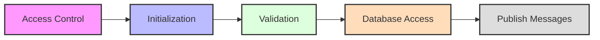

# Legacy Program Flow

```mermaid
graph LR
    A[Access Control] --> B[Initialization]
    B --> C[Validation]
    C --> D[Database Access]
    D --> E[Publish Messages]
    
    style A fill:#f9f,stroke:#333,stroke-width:2px
    style B fill:#bbf,stroke:#333,stroke-width:2px
    style C fill:#dfd,stroke:#333,stroke-width:2px
    style D fill:#fdb,stroke:#333,stroke-width:2px
    style E fill:#ddd,stroke:#333,stroke-width:2px
```

