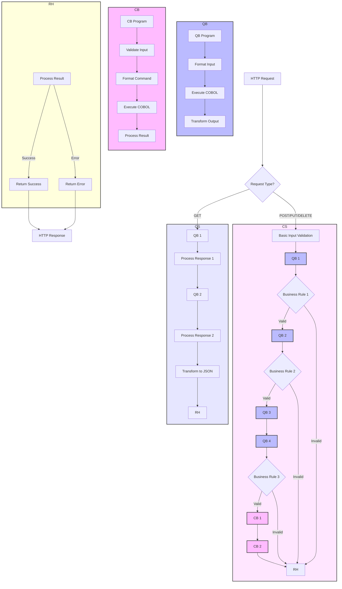

```mermaid
flowchart TD
    
    subgraph QB[QB]
        direction TB
        Q_Program[QB Program] --> Q_Format[Format Input]
        Q_Format --> Q_Execute[Execute COBOL]
        Q_Execute --> Q_Transform[Transform Output]
    end
    
    subgraph CB[CB]
        direction TB
        C_Program[CB Program] --> C_Validate[Validate Input]
        C_Validate --> C_Format[Format Command]
        C_Format --> C_Execute[Execute COBOL]
        C_Execute --> C_Process[Process Result]
    end
    
    subgraph RH[RH]
        direction TB
        Process_Result[Process Result] -->|Success| Success[Return Success]
        Process_Result -->|Error| Error[Return Error]
    end
    
    Request[HTTP Request] --> RequestType{Request Type?}

    RequestType -->|GET| QS_Start[QB 1]
    RequestType -->|POST/PUT/DELETE| CS_Start[Basic Input Validation]

    subgraph QS[QS]
        QS_Start --> QF_Process1[Process Response 1]
        QF_Process1 --> QF_Program2[QB 2]
        QF_Program2 --> QF_Process2[Process Response 2]
        QF_Process2 --> QF_Transform[Transform to JSON]
        QF_Transform --> QS_RH[RH]
    end
    
    subgraph CS[CS]
        CS_Start --> QueryBrick1[QB 1]
        
		QueryBrick1 --> BusinessRule1{Business Rule 1}
        BusinessRule1 -->|Valid| QueryBrick2[QB 2]
		
        QueryBrick2 --> BusinessRule2{Business Rule 2}
        BusinessRule2 -->|Valid| QueryBrick3[QB 3]
		
        QueryBrick3 --> QueryBrick4[QB 4]
        QueryBrick4 --> BusinessRule3{Business Rule 3}
		
        BusinessRule3 -->|Valid| CommandBrick1[CB 1]
        CommandBrick1 --> CommandBrick2[CB 2]
        CommandBrick2 --> CS_RH[RH]
        
        BusinessRule1 -->|Invalid| CS_RH
        BusinessRule2 -->|Invalid| CS_RH
        BusinessRule3 -->|Invalid| CS_RH
    end
    
    Success --> Response[HTTP Response]
    Error --> Response
    
    style QB fill:#bbf,stroke:#333,stroke-width:2px
    style CB fill:#fbf,stroke:#333,stroke-width:2px
    style RH fill:#ffd,stroke:#333,stroke-width:2px
    style QueryBrick1 fill:#bbf,stroke:#333,stroke-width:2px
    style QueryBrick2 fill:#bbf,stroke:#333,stroke-width:2px
    style QueryBrick3 fill:#bbf,stroke:#333,stroke-width:2px
    style QueryBrick4 fill:#bbf,stroke:#333,stroke-width:2px
    style CommandBrick1 fill:#fbf,stroke:#333,stroke-width:2px
    style CommandBrick2 fill:#fbf,stroke:#333,stroke-width:2px
    style QS fill:#e6e6ff,stroke:#333,stroke-width:2px
    style CS fill:#ffe6ff,stroke:#333,stroke-width:2px
```	